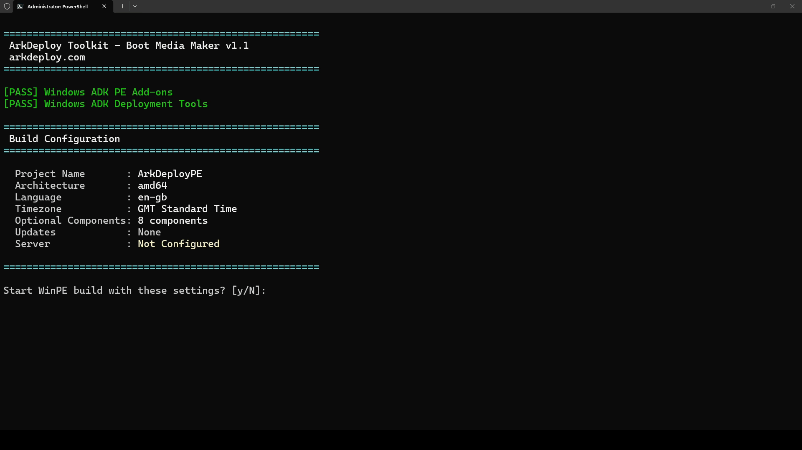
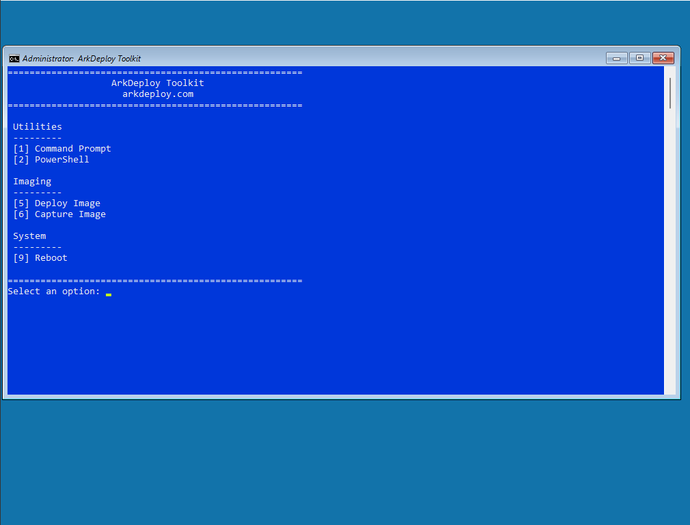
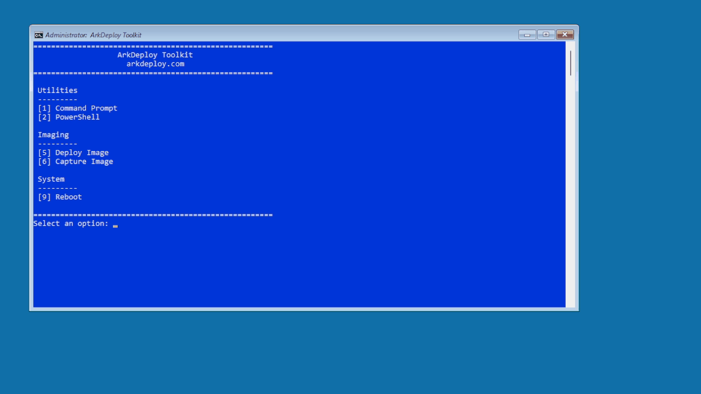
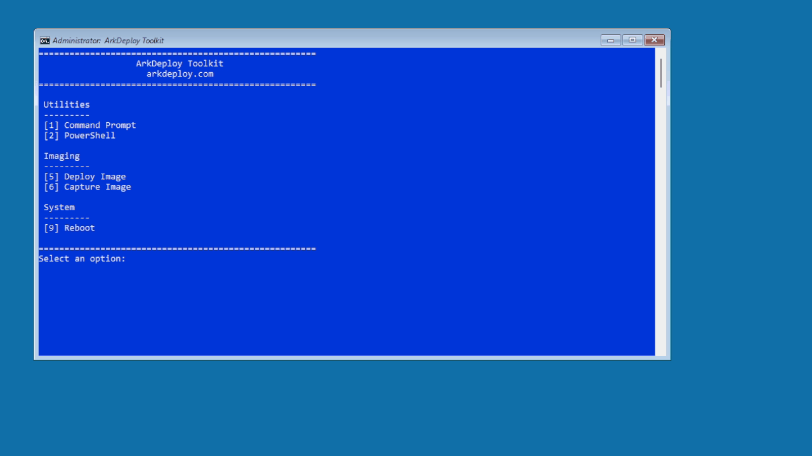

# ArkDeploy Toolkit

A lightweight Windows PE deployment toolkit for deploying and capturing Windows images using Microsoft's Deployment Image Servicing and Management (DISM).

ArkDeploy Toolkit is a free, open-source Windows deployment toolkit designed for IT professionals who prefer simple, transparent imaging workflows over large enterprise deployment platforms.

Developed from real-world OEM Windows deployment experience, ArkDeploy Toolkit focuses on simple, repeatable imaging workflows built on standard Microsoft deployment technologies.

---

## Features

- Deploy Windows images in **WIM** or **ESD** format
- Capture existing Windows installations as **WIM** images
- Create bootable **WinPE USB** or **ISO** deployment media
- Optional **unattend.xml** support
- Deploy and capture images from **USB storage** or **SMB network** shares
- Built entirely with **PowerShell**
- Uses Microsoft's **DISM** deployment engine
- Lightweight, transparent and easy to customise

---

## Toolkit in Action

### Boot Media Builder

Build bootable WinPE USB drives or ISO images in minutes. The toolkit automatically prepares your deployment environment so you can start deploying or capturing Windows images immediately.

### Boot into the Deployment Environment

After creating your boot media, boot any UEFI-compatible device into ArkDeploy Toolkit. The lightweight Windows PE environment provides everything needed to deploy or capture Windows images, whether you're working from a local drive, USB storage, or an SMB network share.

### Deploy Windows Image

Use the **Deploy Image** option to select the target drive, choose the Windows image to deploy, and format the drive before deployment. Optional support for a custom **unattend.xml** file allows Windows Setup to be automated after the image is applied.

### Capture Windows Image

Use the **Capture Image** option to create a Windows **.wim** image from an existing installation. Simply provide an image name and description. The captured image can then be reused for future deployments, creating consistent Windows installations for testing, rebuilding or large-scale deployment.

---

## Why ArkDeploy Toolkit Exists

After years of building and maintaining Windows images in OEM manufacturing environments, I wanted a deployment toolkit that focused on the fundamentals: capture, deploy and automate, without the complexity of enterprise deployment platforms.

Rather than introducing additional infrastructure, ArkDeploy Toolkit builds on Microsoft's existing deployment technologies using readable PowerShell scripts that are easy to understand, modify and extend.

---

## Design Principles

ArkDeploy Toolkit is designed to be:

- Lightweight
- Script driven
- Easy to understand
- Easy to customise
- Built on standard Microsoft deployment technologies

It intentionally avoids:

- Database backends
- Management servers
- Complex infrastructure

---

## Who This Is For

- IT deployment administrators
- System engineers
- MSPs and system builders
- Education IT teams
- Homelab users 

If you care about how Windows is deployed, this toolkit is designed for you.

---

## Getting Started

At a high level, the workflow is:

1. Create bootable WinPE media using the Boot Media Builder
2. Boot the target device into ArkDeploy Toolkit
3. Deploy or capture Windows images
4. Extend the workflow with your own PowerShell modules if required

Detailed setup documentation is available in the **docs** folder.

- [Creating a Bootable ArkDeploy Toolkit USB](docs/ArkDeploy_Bootable_USB_Guide.md)

---

## Documentation

Additional documentation, deployment guides and Windows imaging articles are available at:

- https://arkdeploy.com/arkdeploy-toolkit/
- https://arkdeploy.com/category/arkdeploy-toolkit/

---

## Roadmap

Ideas for future improvements include:

- Additional deployment automation
- FFU (Full Flash Update) deployment support
- SWM (Split WIM) deployment support
- Driver injection workflows
- Image validation tools
- Modular PowerShell extensions

Suggestions and contributions are always welcome.

---

## License

ArkDeploy Toolkit is released under the MIT License.

You are free to use, modify and redistribute the toolkit.

---

## Project Status

ArkDeploy Toolkit is actively maintained and used in real-world deployment workflows.

Issues, feature requests and pull requests are welcome.
