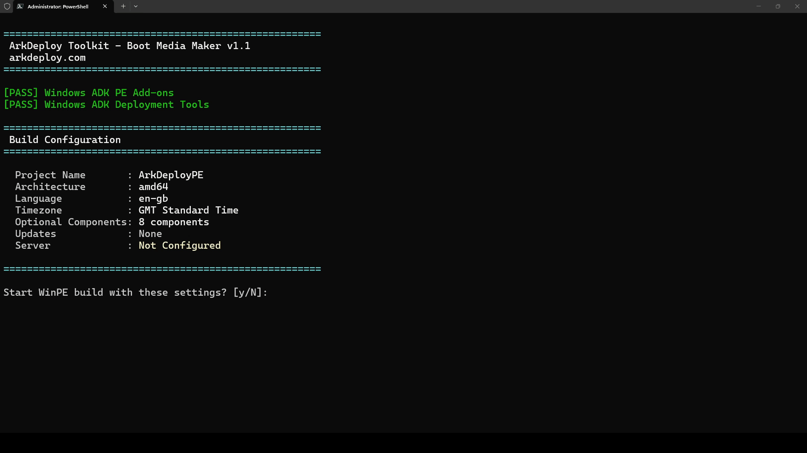
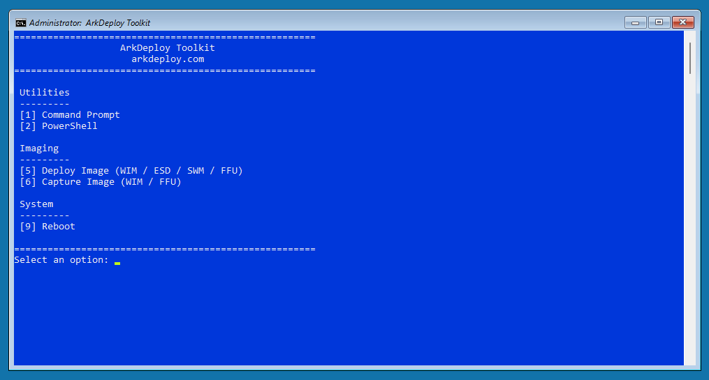
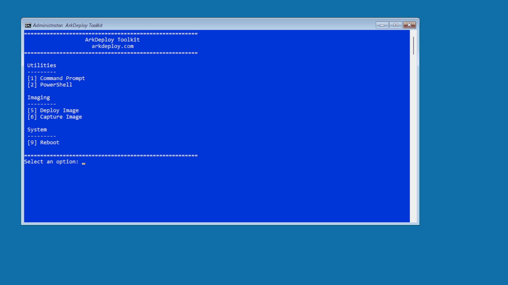
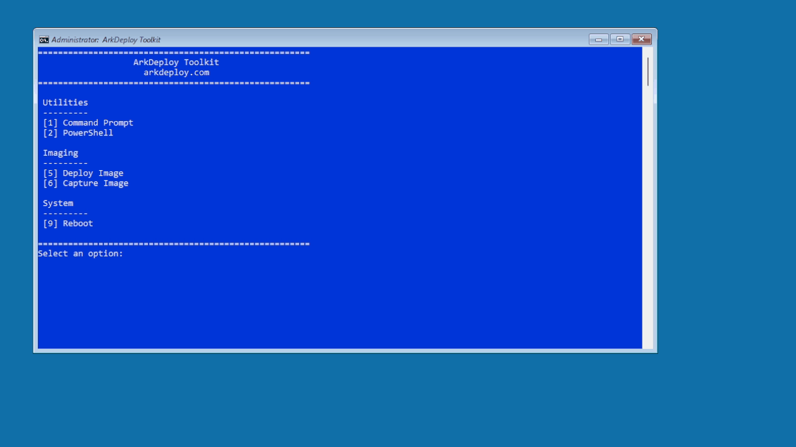

# ArkDeploy Toolkit

A lightweight Windows PE **Operating System Deployment (OSD)** toolkit for deploying and capturing Windows images using Microsoft's Deployment Image Servicing and Management (DISM).

ArkDeploy Toolkit is a free, open-source Windows OSD toolkit designed for IT professionals who prefer simple, transparent imaging workflows over heavy enterprise deployment platforms.

Developed from real-world OEM Windows deployment experience, ArkDeploy Toolkit focuses on simple, repeatable imaging workflows built on standard Microsoft deployment technologies.

---

## Features

- Deploy Windows images in **WIM**, **ESD**, **SWM**, or **FFU** format
- Capture existing Windows installations as **WIM** images or full disks as **FFU** images
- Create bootable **WinPE USB** or **ISO** deployment media
- Optional **network/PXE boot** using the separate [ArkDeploy PXE](https://github.com/ArkDeployDev/ArkDeployPXE/) project
- **Configurable Recovery Partition:** Interactive sizing defaulting to **1500 MB** (optimal for WinRE dynamic servicing updates), or option `[0]` to skip recovery
- **4Kn Drive Compatibility:** Standardized **260 MB** EFI System Partition (ESP) ensuring full support for 4K Native and 512e drives
- **Automation Support:** Script parameters (`-AutoConfirm`, `-NoPrompt`, `-DryRun`, `-RecoverySizeMB`) for headless and automated imaging
- **Dual-Phase `unattend.xml` Support:** Automate both the **WinPE environment** (during media build) and the deployed **Windows OS** (Setup & OOBE automation during deployment)
- **Companion Image Tools (`Tools/`):** Convert WIMs to split SWMs for FAT32 media and optimize FFUs for dynamic drive expansion
- Deploy and capture images from **USB storage** or **SMB network** shares
- Built entirely with **PowerShell**
- Uses Microsoft's **DISM** deployment engine
- Lightweight, transparent and easy to customise

---

## Toolkit in Action

### Boot Media Builder

Build bootable WinPE USB drives or ISO images in minutes. The toolkit automatically prepares your deployment environment with optional drivers, updates, and WinPE unattend configuration so you can start deploying or capturing Windows images immediately.

### Boot into the Deployment Environment

After creating your boot media, boot any UEFI-compatible device into ArkDeploy Toolkit. The same Toolkit-generated WinPE environment can boot from USB/ISO or over the network using the separate [ArkDeploy PXE](https://github.com/ArkDeployDev/ArkDeployPXE/) project. The lightweight Windows PE environment provides everything needed to deploy or capture Windows images, whether you're working from a local drive, USB storage, or an SMB network share.

### Deploy Windows Image

Use the **Deploy Image** option to select the target drive, choose the Windows image to deploy (supporting **.wim**, **.esd**, **.swm**, and **.ffu** formats), and prepare the drive before deployment. Optional support for applying a custom Windows **unattend.xml** answer file allows Windows Setup and OOBE to be fully automated after the image is applied.

### Capture Windows Image

Use the **Capture Image** option to create a Windows **.wim** image from an existing installation or capture a full physical drive as an **.ffu** image. Simply provide an image name and description. The captured image can then be reused for future deployments, creating consistent Windows installations for testing, rebuilding or large-scale deployment.

---

## Companion Image Tools

Included in the `Tools/` folder of the release package, these PowerShell scripts run from an elevated technician workstation to prepare images before placing them on deployment shares or USB drives:

- **Convert WIM to SWM (`Tools/Convert-WimToSwm.ps1`):** Splits large `.wim` files (> 4 GB) into multiple `.swm` parts so they can be stored and deployed from FAT32 USB partitions without hitting file size limits.
- **Extend FFU Image (`Tools/Extend-FfuImage.ps1`):** Optimizes raw captured `.ffu` images via `DISM /Optimize-FFU` so the Windows partition automatically expands to fill 100% of any destination drive on deployment.

---

## Why ArkDeploy Toolkit Exists

After years of building and maintaining Windows images in OEM manufacturing environments, I wanted an **OSD toolkit** that focused on the fundamentals: capture, deploy and automate, without the overhead of heavy enterprise platforms like SCCM/MECM or the legacy complexity of MDT.

Rather than introducing additional infrastructure, ArkDeploy Toolkit builds on Microsoft's existing deployment technologies using readable PowerShell scripts that are easy to understand, modify and extend.

---

## Design Principles

ArkDeploy Toolkit is designed to be:

- Lightweight
- Script driven
- Easy to understand
- Easy to customise
- Built on standard Microsoft deployment technologies

It intentionally avoids:

- Database backends
- Management servers
- Complex infrastructure

---

## Who This Is For

- OSD engineers & desktop deployment specialists
- IT deployment administrators
- System engineers
- MSPs and system builders
- Education IT teams
- Homelab users 

If you care about how Windows is deployed, this toolkit is designed for you.

---

## Requirements

- PowerShell 5.1 or later (running as Administrator)
- Windows Assessment and Deployment Kit (ADK) with the Windows PE add-on installed
- Windows Cumulative Updates (MSUs in `Assets/WU/`, optional)
- Hardware drivers (OEM drivers in `Assets/Drivers/`, optional)

The latest Windows ADK and Windows PE add-on can be downloaded from [Microsoft ADK Documentation](https://learn.microsoft.com/en-us/windows-hardware/get-started/adk-install).

---

## Getting Started

At a high level, the workflow is:

1. Create bootable WinPE media using the Boot Media Builder
2. Boot the target device into ArkDeploy Toolkit from USB/ISO, or optionally over the network using [ArkDeploy PXE](https://github.com/ArkDeployDev/ArkDeployPXE/)
3. Deploy or capture Windows images
4. Extend the workflow with your own PowerShell modules if required

Detailed setup documentation is available in the **docs** folder.

- [Creating a Bootable ArkDeploy Toolkit USB](docs/ArkDeploy_Bootable_USB_Guide.md)

---

## Network Boot with ArkDeploy PXE

[ArkDeploy PXE](https://github.com/ArkDeployDev/ArkDeployPXE/) is a separate, complementary project: a lightweight PXE/TFTP server designed to work with ArkDeploy Toolkit. It allows Toolkit-generated Windows PE `boot.wim` environments to boot over the network instead of USB.

The boot flow is:

**PXE → iPXE → Windows PE → ArkDeploy Toolkit**

Create your WinPE environment using the normal Boot Media Builder workflow, then use the generated `boot.wim` with ArkDeploy PXE for optional network boot. ArkDeploy PXE provides the network boot service; ArkDeploy Toolkit provides the deployment environment and handles deploying or capturing Windows images once Windows PE has loaded.

ArkDeploy Toolkit **v1.1.1+** includes the embedded configuration fallback introduced in v1.1.1, allowing WinPE to operate when PXE booted without a USB-root configuration.

See the [ArkDeploy PXE repository](https://github.com/ArkDeployDev/ArkDeployPXE/) for setup instructions and releases.

---

## Security Considerations

> [!WARNING]
> Server credentials configured for network share mapping are stored in plaintext in `config.json` and copied to the bootable media root directory.

- **Dedicated Service Account:** Use a service account with minimal permissions (read/write access restricted solely to the deployment share).
- **Network Isolation:** Deploy within trusted private VLANs or lab networks.
- **Review Guidance:** See [SECURITY.md](SECURITY.md) for full security best practices, mitigations, and compliance considerations.

---

## Documentation

Additional documentation, deployment guides and Windows imaging articles are available at:

- https://arkdeploy.com/arkdeploy-toolkit/
- https://arkdeploy.com/category/arkdeploy-toolkit/

---

## Roadmap

Ideas for future improvements include:

- Additional deployment automation
- ~~FFU (Full Flash Update) deployment and capture support~~
- ~~SWM (Split WIM) deployment support~~
- Driver injection workflows
- Image validation tools
- Modular PowerShell extensions

Suggestions and contributions are always welcome.

---

## License

ArkDeploy Toolkit is released under the MIT License.

You are free to use, modify and redistribute the toolkit.

---

## Project Status

ArkDeploy Toolkit is actively maintained and used in real-world deployment workflows.

Issues, feature requests and pull requests are welcome.
